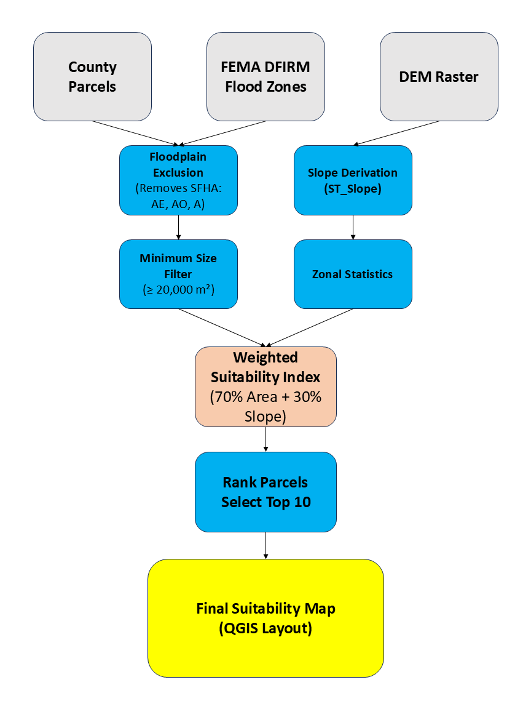

# Solar-site-suitability-postgis
Utility-scale solar site suitability analysis using PostGIS, raster processing, and QGIS cartographic design for the Cincinnati area.

## Project Overview
This project identifies parcels suitable for large-scale solar development in the Cincinnati, Ohio region using spatial constraints and weighted suitability modeling.
The analysis integrates vector and raster data within PostGIS to automate filtering, slope derivation, and parcel scoring. Final cartographic outputs were produced in QGIS.

## Problem Statement
Utility-scale solar developers require:
- Parcels outside FEMA flood zones
- Sufficient land area for infrastructure
- Low slope for constructability
- Objective scoring to rank candidate sites
This project builds a reproducible geospatial workflow to identify and rank optimal parcels.

## Data Sources
- County parcel polygons
- FEMA DFIRM flood zones
- Digital Elevation Model (DEM) raster

## Methodology
### Workflow Diagram

1. Floodplain Exclusion
Removed Special Flood Hazard Areas (SFHA):
- AE
- AO
- A

Challenge encountered:
Flood classification inconsistencies (e.g., "AREA NOT INCLUDED" vs "X") required manual verification and schema cleaning.

2️. Minimum Parcel Size Filter
Parcels filtered to ≥ 20,000 m² (~5 acres) to reflect utility-scale feasibility.

3️. Slope Derivation (Raster Analysis)
DEM processed in PostGIS using:
ST_Slope()
Zonal statistics per parcel
Parcels exceeding 5° average slope removed.

4️. Suitability Scoring
- Composite index:
- Suitability Score =
- (0.7 × normalized parcel area) +
- (0.3 × normalized slope suitability)
- Parcels ranked based on composite score.

## Results
- 1,581 candidate parcels identified
- Top 10 parcels highlighted and ranked
- Highest suitability parcel > 80% composite score

Final deliverable map:
![Solar Suitability Map]"(outputs/Solar Suitability Map.png)"

## Technologies Used
- PostgreSQL + PostGIS
- Raster functions (ST_Slope, zonal stats)
- QGIS 3.40
- GeoJSON export

## Skills Demonstrated
- Spatial SQL
- Raster-vector integration
- Suitability modeling
- Data cleaning and classification troubleshooting
- Cartographic design
- Reproducible workflow documentation

## Future Improvements
- Integrate proximity to substations and transmission lines
- Add land cover constraints
- Automate workflow using Python (GeoPandas + Rasterio)
- Develop interactive web map
